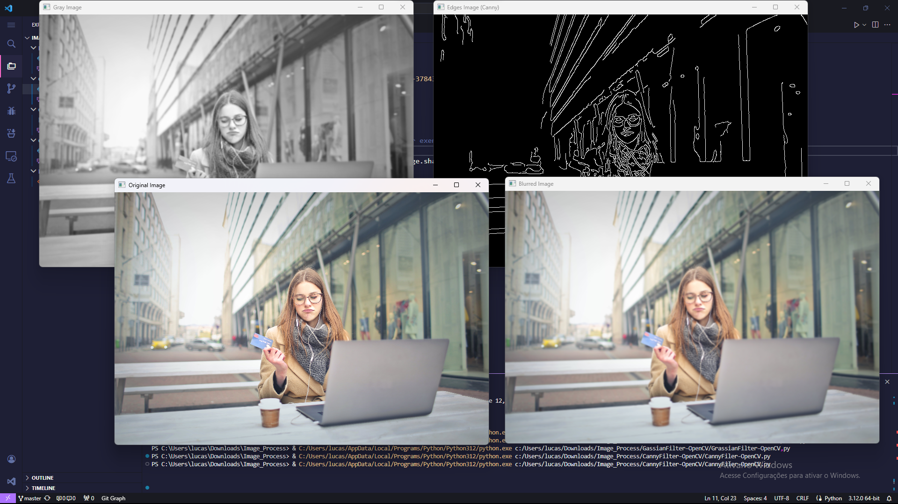

# Universidade Cruzeiro do Sul

**Curso:** Inteligência Artificial  
**Disciplina:** Processamento de Imagens  
**Aluno:** Lucas Dias Noronha  
**Semestre:** 3°  
**Ano:** 2024

Este repositório abrange estudos de casos abordados no curso de Inteligência Artificial da Universidade Cruzeiro do Sul.

